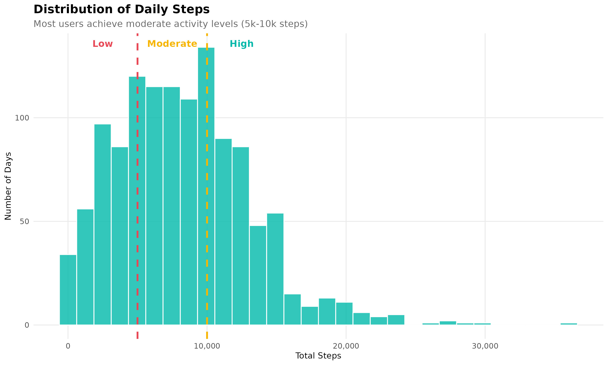
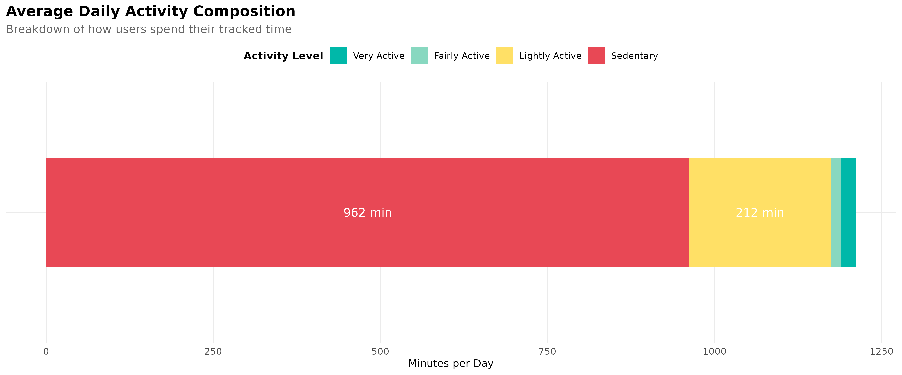
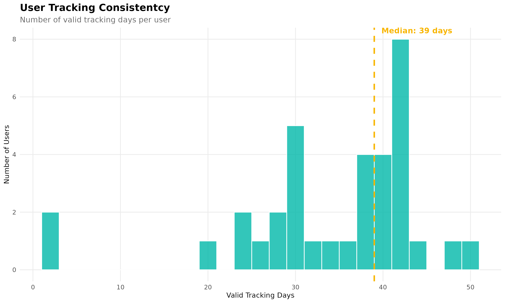
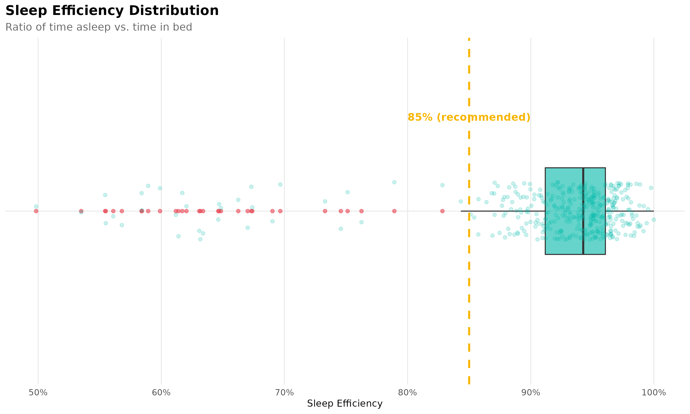
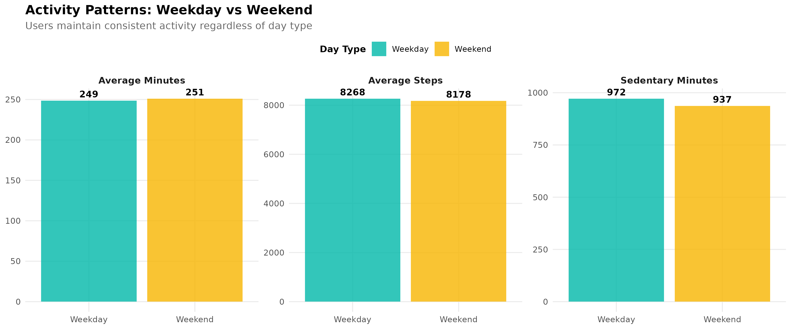
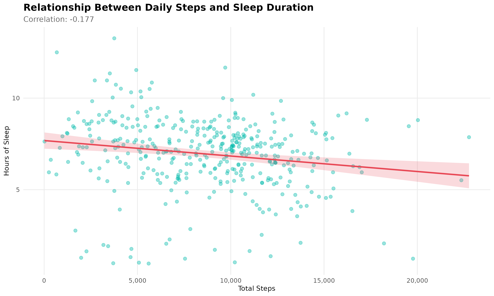

# Bellabeat Case Study

## 1. ASK PHASE

### Business Task

Guide the marketing strategy for Bellabeat's Leaf product by identifying trends in user behaviour from non-Bellabeat smart device data.

### Key Questions

- What are the main trends in device usage?
- How applicable/relevant are these trends to Bellabeat customers?
- How could these trends translate to Bellabeat's marketing strategy?

### Stakeholders

- Urška Sršen (CCO)
- Sando Mur (Co-founder, mathematician)
- Marketing Analytics Team

---

## 2. PREPARE PHASE

### Data Source

- **Dataset:** Fitbit Fitness Tracker Data (Kaggle)
- **Participants:** Amazon Mechanical Turk
- **Time Period:** 12 March 2016 – 12 May 2016
- **License:** CC0 Public Domain

Contains personal tracker data including:

- Daily physical activity
- Heart rate
- Sleep monitoring
- **Number of users:** 30+ (varies across datasets)

### Folder Structure

- **Folder A:** 12 March – 11 April 2016
- **Folder B:** 12 April – 12 May 2016

### Files Used

- `dailyActivity_merged.csv` (Folders A & B)
- `sleepDay_merged.csv` (Folder B)

### Data Storage

- Raw files stored locally on Mac
- Working copies created in Google Sheets
- Exported to a separate `/working` folder

### Data Organisation

| Folder | File                     | Topic    | Granularity | Format |
| ------ | ------------------------ | -------- | ----------- | ------ |
| A&B    | dailyActivity_merged.csv | Activity | Daily       | Long   |
| B      | sleepDay_merged.csv      | Sleep    | Daily       | Long   |

### Credibility / Bias (ROCCC)

- **Reliable:** Device output with documented source
- **Original:** Direct tracker export
- **Comprehensive:** Includes activity and sleep measures
- **Current:** Data from 2016 (outdated; interpret cautiously)
- **Cited:** Kaggle + CC0 license

### Data Integrity Checks

Performed in Google Sheets.

Checks included:

- Schema validation
- Row counts
- Date range
- Unique users
- Missing values
- Duplicates
- Date parsing

### Data Quality Summary

**dailyActivity_merged.csv (March)**

- Rows: 457
- Users: 35
- Missing values: 0
- Duplicates: 0
- Status: Clean

**dailyActivity_merged.csv (April)**

- Rows: 940
- Users: 33
- Missing values: 0
- Duplicates: 0
- Status: Clean

**sleepDay_merged.csv (April)**

- Rows: 413
- Users: 24
- Missing values: 0
- Duplicates removed: 3
- Status: Minor cleaning required

### Preparation Outcomes and Next Steps

- Remove duplicate rows from sleep dataset
- Standardise date formats
- Document dataset coverage differences
- Account for coverage differences during joins

### Data Considerations

- **Privacy:** anonymised IDs
- **Security:** stored locally
- **Accessibility:** public domain

### Dataset Relevance to Business Questions

**Device usage trends**  
Daily activity data reveals engagement patterns and movement behaviour.

**Applicability to Bellabeat customers**  
Activity and sleep tracking align with Bellabeat's wellness products, though lack of demographic data limits generalisation.

**Marketing insights**  
Usage patterns help identify user segments and features to emphasise.

---

## 3. PROCESS PHASE

### Tools

- **Platform:** R / RStudio Cloud
- **Packages:** tidyverse, lubridate

### Data Files Processed

- `dailyActivity_merged` (Folder A)
- `dailyActivity_merged` (Folder B)
- `sleepDay_merged` (Folder B)

### Processing Steps

#### Step 1: Upload Data

Created `/FitBit` folder in RStudio Cloud and uploaded files.

#### Step 2: Load and Clean Data

**Combine Activity Data**

- Rows: 1397
- Users: 35

**Clean Sleep Data**

- Rows: 410
- Users: 24

**Date Standardisation**

- ActivityDate → Date format
- SleepDay → Date format
- Sleep timestamps occurred at midnight

### Final Clean Datasets

**activity_combined**

- 1397 rows
- 35 users
- March–May 2016

**sleep_clean**

- 410 rows
- 24 users
- April–May 2016

### User Coverage

- 24 users tracked activity + sleep
- 11 users tracked activity only
- 0 users tracked sleep only
- Sleep tracking users are a subset of activity users

---

## 4. ANALYZE PHASE

### Objective

Identify behavioural trends in activity, engagement, and sleep tracking to inform Bellabeat's marketing strategy.

### Activity Trends

#### Daily Steps

- **Median:** 7,881 steps
- **Mean:** 8,243 steps
- **IQR:** 4,697–11,101 steps
- Users maintain moderate activity with occasional high-activity days

#### Sedentary Time

- **Median:** ~17 hours/day
- **Mean:** ~16 hours/day
- Likely includes sleep and desk-based time

#### Non-Wear Behaviour

~11% of tracked days appear to be non-wear days:

- 0 steps
- 1440 sedentary minutes
- Indicates inconsistent engagement

#### Activity Intensity Patterns

| Activity Type | Median minutes/day |
| ------------- | ------------------ |
| Light         | 212                |
| Fairly active | 8                  |
| Very active   | 6                  |

Movement primarily comes from everyday activity.

#### Step-Based Segments (Valid Wear Days)

- **Moderate (5–10k):** 37.6%
- **High (>10k):** 35.2%
- **Low (<5k):** 27.2%

#### Engagement Levels

- **Median valid days:** 39
- **IQR:** 30–42
- **Range:** 2–50

### Sleep Trends

#### Sleep Duration

- **Average:** ≈ 7 hours/night
- **Range:** ~1–13 hours

#### Sleep Efficiency

- **Average:** ≈ 0.92–0.94

#### Sleep Tracking Engagement

Of 35 activity users:

- 24 (68.6%) tracked sleep
- 11 (31.4%) did not
- **Median nights logged:** ~20
- **Range:** 1–31 nights

#### Activity vs Sleep Relationship

- **Correlation:** r = −0.18
- Very weak relationship
- Only ~32% of activity days include sleep records

#### Weekday vs Weekend Behaviour

- **Weekday steps:** ~8,268
- **Weekend steps:** ~8,178
- Sedentary time similar
- Users maintain stable routines

---

## 5. SHARE PHASE

This analysis identifies key trends in smart device usage through visualisations examining activity patterns, sleep behaviour, and engagement.

### Key Findings

#### Daily Activity Distribution

Most users fall within the moderate activity range (5k–10k steps). Movement is generally consistent with occasional high-step outliers.

#### Average Daily Activity Composition

Daily movement is dominated by:

- Sedentary time (~962 minutes)
- Light activity (~212 minutes)

Users are primarily lifestyle-movement users rather than fitness-focused users.

#### User Tracking Consistency

- **Median tracking duration:** 39 days
- Engagement varies widely across users

Two groups emerge:

- Consistent users
- Early drop-off users

#### Sleep Efficiency Distribution

- **Average sleep efficiency:** ≈ 94%
- Most users exceed recommended thresholds, though occasional low-efficiency nights appear

#### Weekday vs Weekend Patterns

Activity patterns remain stable across day types.

#### Steps vs Sleep Duration Relationship

- **Correlation:** ≈ −0.18
- Relationship between steps and sleep duration is weak
- Only ~32% of activity days include sleep records

---

## 6. ACT PHASE

Based on the analysis of Fitbit user behaviour, the following recommendations focus on improving user retention, positioning Bellabeat products more effectively, and supporting sustainable wellness habits. These recommendations translate data insights into marketing and product strategy opportunities.

### Recommendation 1: Address User Engagement Drop-Off

**Insight**  
The wide variation in tracking consistency (median: 39 days; range: 2–50 days) suggests two distinct user groups: committed long-term trackers and users who disengage early.

**Recommendation**  
To improve retention, Bellabeat should focus on positioning Leaf as a device designed for long-term, sustainable use.

- **Marketing angle:** Position Leaf as "the wellness companion you'll actually keep wearing", emphasising its elegant, jewellery-like design compared to bulky fitness trackers
- **Feature highlight:** Promote habit-building features such as streak tracking, milestone celebrations, and gentle reminders
- **Target audience:** Focus on users seeking sustainable lifestyle habits rather than short-term fitness goals or high-intensity training

### Recommendation 2: Target the "Lifestyle Wellness" Audience

**Insight**  
User activity patterns suggest most users engage primarily in light daily movement rather than intense exercise, indicating a "lifestyle wellness" audience rather than fitness enthusiasts.

**Recommendation**  
Bellabeat should position Leaf as a wellness companion integrated into everyday life.

- **Marketing angle:** Present Leaf as a wellness device for daily living, not an athletic performance tracker
- **Target demographic:** Busy professionals and individuals balancing multiple responsibilities who value realistic, sustainable wellness routines
- **Messaging:** Emphasise small, achievable improvements — daily steps, gentle movement reminders, and personalised wellness nudges
- **Differentiation:** Position Bellabeat as the elegant, holistic wellness alternative to performance-focused fitness brands

### Recommendation 3: Promote Sleep Tracking as a Key Feature

**Insight**  
Sleep efficiency appears strong when tracked, but sleep data coverage is limited (approximately 32% of activity days include sleep records), and the correlation between activity and sleep is weak.

**Recommendation**  
Bellabeat should encourage more consistent sleep tracking to unlock deeper wellness insights.

- Position comprehensive wellness tracking (activity + sleep) as a key differentiator from basic step counters
- Develop educational marketing content explaining sleep efficiency and its importance beyond physical activity
- Highlight Leaf's comfortable, lightweight, and sleep-friendly design, which enables all-day and overnight wear
- Promote campaigns focused on understanding daily rhythms and sleep habits, not just physical movement

### Recommendation 4: Leverage Consistency Across Day Types

**Insight**  
Users maintain stable activity patterns across weekdays (8,268 steps) and weekends (8,178 steps), suggesting established routines that persist regardless of schedule.

**Recommendation**  
Bellabeat should position Leaf as a device that integrates seamlessly into existing routines.

- Target users who value consistency and balance, rather than lifestyle transformation
- **Messaging:** "Your wellness companion for every day"
- **Feature highlight:** Adaptive, non-intrusive notifications that align with users' existing behaviour patterns

### Recommendation 5: Encourage Consistent Daily Movement

**Insight**  
Most users fall within a moderate activity range (5,000–10,000 steps), but a meaningful number of low-activity days still occur.

**Recommendation**  
Bellabeat should support users in maintaining consistent moderate movement.

- **Marketing angle:** Position Leaf as a supportive companion that provides encouraging, personalised nudges
- **Feature highlight:** Promote pattern recognition and timely, personalised movement reminders
- **Emphasise:** Positive reinforcement and small wins, rather than performance pressure
